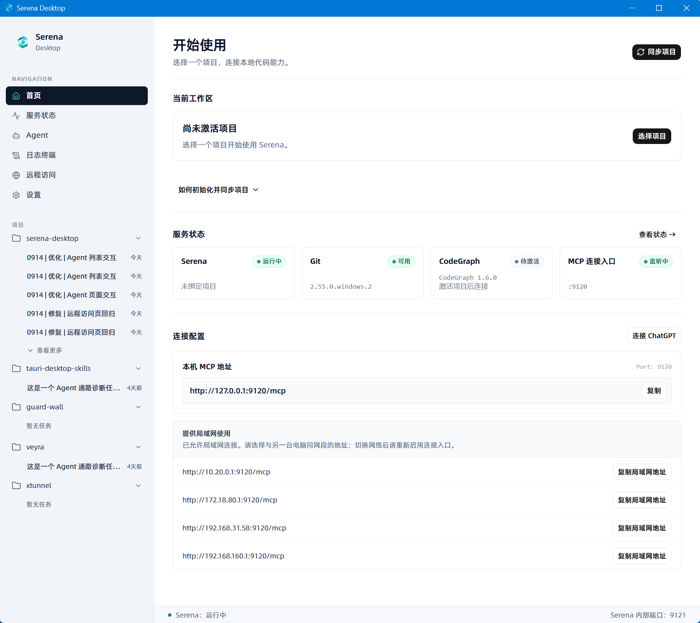
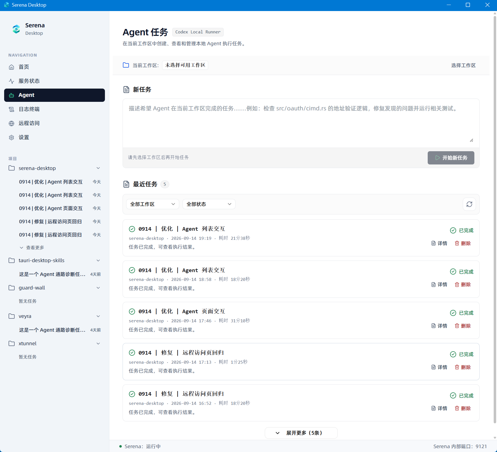
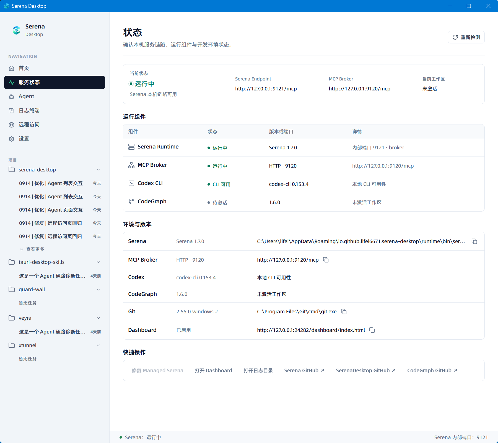
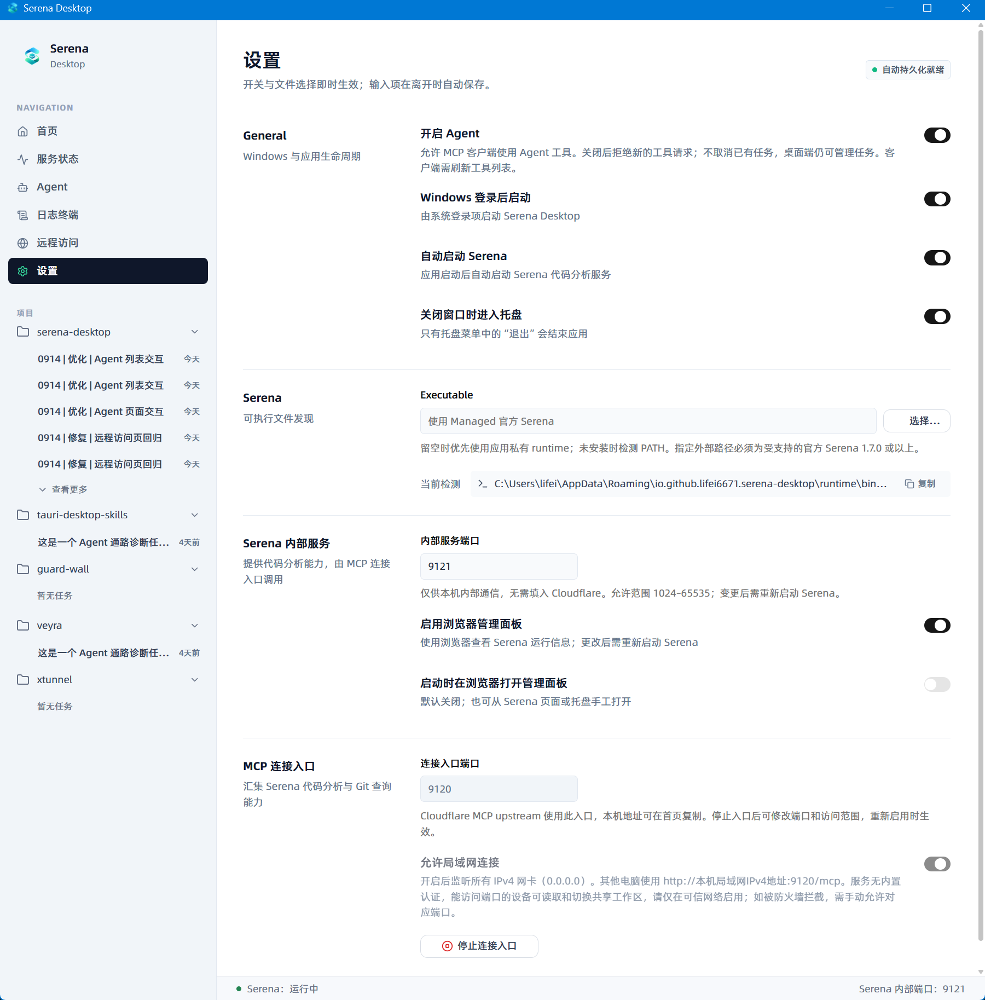
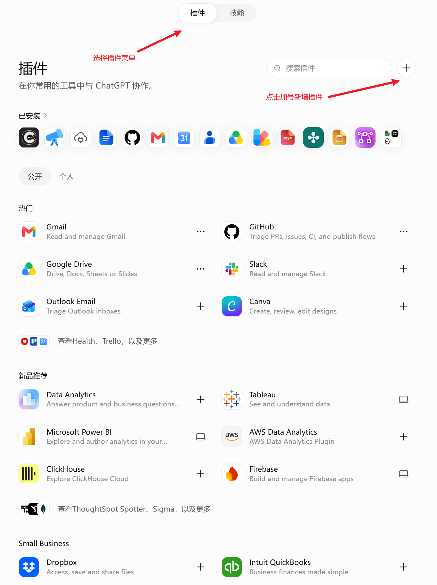
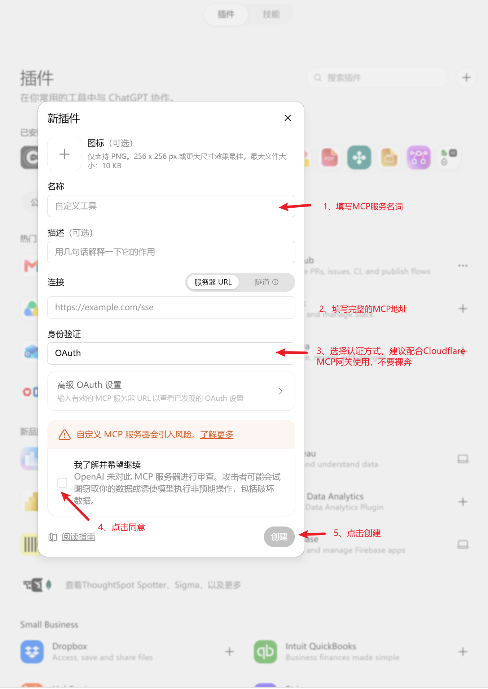

# Serena Desktop

## 让 ChatGPT 连上你的电脑，指挥 Codex 把想法做出来。

**Serena Desktop 是连接 ChatGPT 与本地项目的 MCP 桥梁。** 让 ChatGPT 直接读取项目文件、理解代码、查看 Git 变更，再把明确的开发任务交给你电脑上的 Codex 执行。

你在 ChatGPT 里讨论需求、确定方向；ChatGPT 通过 MCP 获取真实项目上下文、派发任务、检查结果；Codex 在本地完成修改和测试。

**从“帮我想想怎么做”，到“结合我的项目，把它做出来”。**

[下载 Windows 版本](https://github.com/lifei6671/serena-desktop/releases) · [快速开始](#快速开始) · [看看可以怎么用](#连接之后你可以这样说) · [反馈与建议](https://github.com/lifei6671/serena-desktop/issues)



## 少搬运上下文，多推进项目

在 ChatGPT 里讨论开发时，你可能反复做着同一件事：复制代码、粘贴报错、解释目录，把讨论好的方案转交给 Codex，再把执行结果搬回来。

Serena Desktop 把这条路接通。ChatGPT 可以按需读取当前项目的文件和代码关系，拿着真实上下文分析问题，再通过 MCP 调用本地 Codex。执行结束后，还能继续读取结果与实际变更，判断是否符合你的要求。

```text
你在 ChatGPT 中提出需求
          ↓
ChatGPT 通过 Serena Desktop MCP 连接本地项目
          ├─ 读取文件、搜索代码、查看图片与 Git 变更
          ├─ 分析问题，明确修改范围与验收要求
          └─ 派发任务给本地 Codex
                         ↓
                  修改代码、运行测试
                         ↓
ChatGPT 获取执行结果，检查变更，与你继续迭代
```

**ChatGPT 负责理解与指挥，Codex 负责本地执行，Serena Desktop 负责把两者连起来。**

## 让 ChatGPT 看懂你正在做的项目

不必每次从目录结构讲起。连接之后，ChatGPT 可以通过 MCP 读取当前工作区中的源码、配置和文档，搜索实现、定位符号与引用；也可以查看项目中的截图，结合实际界面讨论问题。

| 你想了解什么 | ChatGPT 可以获取的本地上下文 |
|---|---|
| “这个功能现在是怎么实现的？” | 项目文件、代码搜索、符号定义与引用 |
| “改这里会影响哪里？” | CodeGraph 提供的调用路径、依赖关系与影响范围 |
| “这次到底改了什么？” | Git 状态、差异、提交历史、分支与 worktree 信息 |
| “这个页面哪里需要调整？” | 当前工作区内的 PNG、JPEG、WebP 图片 |

文件访问以当前活动项目为范围。CodeGraph 需要单独安装并初始化项目索引。

## 在 ChatGPT 里定方案，让本地 Codex 动手

当讨论进入实施阶段，你可以让 ChatGPT 把目标、相关文件和验收要求交给 Codex：修复一个问题、补齐一项功能，或运行针对性的测试。

任务通过 MCP 派发到本机。ChatGPT 可以查询进度、获取执行结果，并根据你的要求继续任务或取消执行。你也可以打开桌面的 Agent 页面，查看任务记录、状态与结果详情。

这让“讨论、执行、检查”能够围绕同一个项目连续进行，减少在聊天窗口和开发工具之间转述信息。



## 连接之后，你可以这样说

**接手一个项目**

> 请使用 Serena Desktop 读取当前项目的 README 和主要入口，解释项目结构，并指出实现登录流程的关键文件。

**修复一个具体问题**

> 请结合当前项目代码分析这个报错，确定原因和最小修改方案，再调用本地 Codex 修复并运行相关测试。完成后读取 Git diff，检查是否解决问题。

**把想法变成功能**

> 我想给任务列表增加状态筛选。先查看现有实现，沿用当前界面和数据结构，再让 Codex 完成修改，最后检查结果。

**检查一次交付**

> 请查看 Codex 的执行结果和当前工作区变更，对照刚才的需求检查是否有遗漏，并区分已通过的验证和仍未验证的部分。

这些是对话示例；实际执行需要可用的本地环境、已启用的 Agent 能力，以及明确的任务范围。

## 本地连接，也要用得顺手

打开桌面应用，就能确认当前连接的是哪个项目、服务是否运行、MCP 地址在哪里。遇到连接问题，可以集中查看运行状态、依赖版本和日志。



登录自启、自动启动 Serena、关闭窗口进入托盘，都可以按习惯设置。让本地服务融入日常开发，随时为 ChatGPT 提供项目上下文。



## 快速开始

### 1. 准备本地环境

从 [Releases](https://github.com/lifei6671/serena-desktop/releases) 下载 Windows 版本。预先安装 Git，在 Serena Desktop 中检测或安装官方 Serena，并启动服务。

如果希望 ChatGPT 指挥 Codex 工作，还需要本机已安装、完成登录且可用的 Codex，并在 Serena Desktop 中启用 Agent 能力。

### 2. 连接你的项目

在 Git 仓库根目录打开 PowerShell，初始化 Serena 项目并建立索引：

```powershell
serena project create --index
```

如果已有 `.serena/project.yml`，则执行：

```powershell
serena project index
```

回到 Serena Desktop 首页，点击“同步项目”，选择并激活项目。若终端找不到 `serena` 命令，展开首页的初始化提示，使用应用检测到的可执行文件路径和同步配置目录。

### 3. 获取 ChatGPT 可以连接的地址

打开首页的“连接 ChatGPT”或侧边栏“远程访问”，根据你的接入方式完成配置：

| 连接方式 | 适用场景 |
|---|---|
| 快捷隧道 | 使用临时公网地址连接，适合开始体验；重新开启后地址可能变化 |
| 自建接入 | 使用自有 HTTPS 入口，或配置 ngrok 接入 |
| 仅 MCP | 已有负责认证和转发的 MCP 网关，或供本机客户端使用 |

使用快捷隧道或自建接入时，Serena Desktop 提供内置 OAuth，并在本机弹窗中由你确认客户端授权。使用“仅 MCP”时，认证由你的外部网关配置决定。

按页面提示开启连接并完成连接测试，复制完整的公网 MCP 地址，例如 `https://mcp.example.com/mcp`。下面采用 ChatGPT 的“服务器 URL”方式，因此需要 ChatGPT 可访问的 HTTPS 地址，不能直接填写 `127.0.0.1` 或局域网 IP。

自有 HTTPS 代理需转发 `/mcp`、`/.well-known/*` 和 `/oauth/*`，具体说明见[远程访问文档](docs/remote-access-ui.md)。

### 4. 在 ChatGPT 中添加连接

在 ChatGPT 的“设置 → 安全与登录”中开启开发者模式，进入“插件”页面，点击 **＋** 添加 MCP 连接。

| 表单项目 | 填写说明 |
|---|---|
| 名称 | `Serena Desktop` |
| 描述 | 连接本地项目，读取文件、分析代码，并指挥本地 Codex 执行开发任务 |
| 连接 | 选择“服务器 URL”，粘贴完整的 HTTPS MCP 地址 |
| 身份验证 | 使用应用内置授权时选择 OAuth；使用外部网关时按其实际认证方式配置 |

创建连接并完成授权；使用内置 OAuth 时，还需在本机 Serena Desktop 的授权弹窗中确认。随后检查 ChatGPT 发现的工具列表。

| 第一步：打开插件，点击加号 | 第二步：填写信息，创建插件 |
|:---:|:---:|
|  |  |

截图用于展示操作位置，界面可能随版本调整；开发者模式是否可用取决于账户与工作区策略。连接流程参见 [OpenAI 官方指南](https://developers.openai.com/plugins/deploy/connect-chatgpt)。

### 5. 开始第一次协作

新建一段 ChatGPT 对话，从工具菜单添加 **Serena Desktop**，发送：

> 请使用 Serena Desktop 确认当前活动项目，读取 README，并总结当前 Git 工作区的变更。

确认返回的项目与桌面首页一致后，就可以继续提出需求、分析代码，再把明确的修改交给本地 Codex。

## 使用前，你可能想知道

**文件是在本地处理的吗？**

项目文件与 Codex 执行环境位于你的电脑上。ChatGPT 通过 MCP 获取所调用工具返回的文件内容、图片或执行结果，因此被读取的内容会传给连接的 AI 服务。

**ChatGPT 能直接改写任意本地文件吗？**

文件读取和代码查询面向当前活动工作区；实际修改与测试通过本地 Codex 执行，受其执行权限约束。ChatGPT 负责分析和检查，Serena Desktop 提供连接与任务控制。

**多个项目怎么用？**

先同步已初始化的项目，再选择需要使用的工作区。所有 MCP 客户端共享当前活动项目；切换后，它们后续的项目查询也会随之切换。

**使用时需要一直开着电脑吗？**

需要保持本机、Serena Desktop、Serena 服务及对应连接入口运行。快捷隧道的临时地址变化后，需要更新 ChatGPT 中的连接地址。

**可以接入其他 MCP 客户端吗？**

可以，支持 HTTP MCP 的客户端也能使用。默认本机入口为 `http://127.0.0.1:9120/mcp`，认证要求取决于当前连接模式。仅 MCP 模式若不使用认证，应限于可信环境，不要直接向公网暴露。

## 开发与技术文档

想了解实现或参与贡献，可以从以下文档开始：

- [V0.3 技术方案](docs/technical-design-v0.3.md)
- [远程访问与授权](docs/remote-access-ui.md)
- [ChatGPT 与本地 Agent 的任务编排](docs/core-work-orchestration.md)
- [Codex Agent Runtime](docs/codex-agent-runtime.md)
- [Agent 状态观察](docs/codex-agent-observe.md)

<details>
<summary>本地开发</summary>

需要 Node.js `^20.19.0` 或 `>=22.12.0`、npm、Rust 和 Tauri 2 的 Windows 构建依赖。

```powershell
npm install
npm run tauri dev
```

验证与构建：

```powershell
npm run lint
npm run build
cargo check --manifest-path src-tauri/Cargo.toml
cargo test --manifest-path src-tauri/Cargo.toml
cargo clippy --manifest-path src-tauri/Cargo.toml -- -D warnings
npm run tauri build
```

当前配置关闭安装包 bundling，构建产物为 `src-tauri/target/release/serena-desktop.exe`。自动发布流程见 [Release 工作流](.github/workflows/release.yml)。

</details>

## 把下一次开发讨论，接到真实项目上

[下载 Serena Desktop](https://github.com/lifei6671/serena-desktop/releases)，让 ChatGPT 读懂你的本地项目，让 Codex 接手明确的开发任务。

欢迎通过 [Issues](https://github.com/lifei6671/serena-desktop/issues) 分享使用反馈。如果这正是你需要的协作方式，也欢迎点亮 **Star**。
