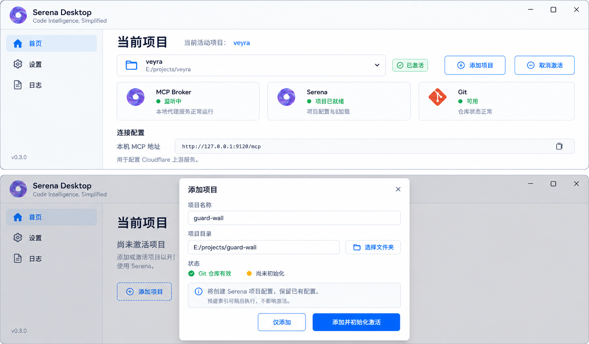

# Serena Desktop MCP Broker 技术方案 v0.3

## 1. 目标与版本边界

Serena Desktop 在现有 Supervisor 基础上增加 Rust MCP Broker，对上游提供一个 Streamable HTTP Endpoint，统一 Workspace 下的源码查询与 Git 检查，并为后续工具扩展提供明确入口。

本版本交付：

- 官方 Serena：文件、符号、引用和代码搜索。
- 内嵌 Git 工具：通过系统 Git CLI 提供六个只读能力。
- Workspace 注册、激活、查询与跨后端一致性。
- 内部静态 Tool Registry：统一注册 Rust 内嵌工具和 Serena Adapter，保留后续第三方 MCP Adapter 的代码扩展入口。

首版不交付配置式第三方 MCP 聚合、工具热重载、通用绑定模式或动态 Schema 兼容引擎；未来接入真实后端时再确定所需机制。

CodeGraph 不再是本版本必需依赖，不提供默认 Graph 工具。后续确有跨模块分析收益时，通过同一扩展机制接入。

本方案在 Broker、官方 Serena 和 Git 归属方面取代 `technical-design-v0.2.md` 的 Enhanced/Fork 方案；现有实现不代表本方案已经落地。保留原有检测、安装、启停、日志、Dashboard、托盘和单实例行为。

不实现插件市场、动态加载 Rust 库、任意脚本工具、OAuth/RBAC 管理、自动工具语义转换或 MCP resources/prompts 聚合。远程认证及访问入口继续由现有外部接入设施负责。

## 2. 架构

```text
ChatGPT / MCP Client
        │
现有 Cloudflare 接入
        │ Streamable HTTP
        ▼
Serena Desktop Rust Backend
  MCP Server (/mcp)
        │
  Tool Registry + Dispatcher
        │
        ├── Workspace 管理工具
        ├── Builtin Handler ── Git CLI / 后续内嵌工具
        └── Serena Adapter ── 官方 Serena MCP
                │
          Workspace Coordinator
```

Broker 仅监听 `127.0.0.1:<broker-port>`。Serena 使用独立本机端口，作为内部后端。本版本仅连接受管 Serena HTTP 服务，不开放任意 MCP Server 注册。

所有工具经过同一注册、参数检查、Workspace 检查、执行和结果处理路径。前端通过 Tauri IPC 管理状态，不直接承载 MCP 服务。

## 3. Workspace 模型

```rust
struct Workspace {
    id: String,
    name: String,
    root: PathBuf,
}
```

Registry 保存在现有应用配置中，ID 唯一；root 必须是存在的 Git 工作树根目录，接受 Git worktree，不能仅靠 `.git` 是否为目录判断。使用 Git 查询并规范化根路径，拒绝把任意子目录登记为不同的仓库身份。

ActiveWorkspace 是进程级共享状态，不持久化；每次启动为 None。多个 MCP Session 共享这一状态，任一客户端激活都会影响后续客户端调用。`workspace_current` 和激活结果必须返回 workspace ID、规范化 root 和后端状态；这是 single-active-workspace 产品限制，不支持不同客户端同时绑定不同项目。读写锁只保证一次调用不会串项目，不能保护客户端跨多次调用的项目预期。

仅公开：

- `workspace_list`：列出本地已登记仓库。
- `workspace_current`：返回当前状态，可在无活动仓库时调用。
- `workspace_activate`：仅接受已登记且项目配置可加载的 workspace ID；配置缺失或无效返回 `WORKSPACE_NOT_CONFIGURED`，不通过远程请求隐式创建项目。
- `workspace_deactivate`：无参数，取消当前激活；无活动项目时幂等成功。

仓库的新增、修改、删除由 Desktop 本地 UI 完成，不通过远程 MCP 接受任意本地路径。活动仓库配置修改或删除前先清除其活动状态。

### 3.1 手动添加与初始化

用户在首页点击“添加项目”，选择本地目录并填写显示名称。校验目录和 Git 根，按规范化 root 去重；重复添加定位到已有记录，不再次创建。无 Git 仓库时提示选择有效仓库，不自动执行 git init。显示名称与稳定 ID 分离，改名不改变 ID。

弹窗提供“仅添加”和“添加并初始化激活”。仅添加只登记 Desktop 配置；后一操作顺序执行登记 → 初始化 → 激活。登记成功而后续失败时保留项目及失败阶段，允许重试，不删除已有项目文件。

初始化为本地 Tauri 管理动作，定义为创建或验证 Serena 项目配置，不包含必须成功的预索引。用户点击初始化即授权创建必要项目配置；保留已有配置，不修改业务源码、不提交 Git、不自动执行 onboarding。远程 MCP 不提供初始化工具，也不隐式创建配置。

```text
# 配置不存在时创建；已有配置则验证并复用
serena project create <absolute-root>

# 用户在项目菜单主动选择“预建索引”时执行
serena project index <absolute-root>
```

命令通过参数数组调用受管 executable，cwd 为 root，使用第 7 节同一受控配置。`serena init` 是全局初始化，不能替代项目创建。针对选定发行版验证 CLI 参数；多语言选择或检测失败在本地 UI 处理，不能让隐藏进程等待交互输入。

分别呈现三类事实：项目是否已登记、Serena 配置是否可加载、最近一次预索引操作的结果。预索引结果可为未运行、运行中、完成、部分失败、失败或已取消，不代表所有符号查询永远健康；重启后无法核实的历史结果标为未知，不持久化“健康”承诺。

激活条件为已登记、Git 根有效、Serena 配置可加载，并通过实际激活及 root 验证。**未预索引、部分索引失败或索引失败都不单独阻止激活。** 查询若失败按真实后端错误返回，不能仅据预索引失败断言符号查询必然不完整。UI 提示“预建索引部分失败，可继续使用；查看日志或重试”。

预建索引是可选本地操作，不随添加或应用启动自动运行；显示日志、结果和取消入口，不伪造百分比。检查选定版本的索引报告及失败清单，不能仅凭 exit code 0 判定全部完成。

项目初始化与切换等管理操作串行；初始化 B 失败不改变已激活 A。主动预索引与查询通过现有 Workspace 锁协调，首版不另建任务调度框架：预索引期间等待/暂停仓库查询，支持超时和取消，完成后原活动项目继续可用。锁等待与操作进度在 UI 可见。取消需回收命令进程，不删除已有配置或缓存。

### 3.2 取消激活

本地“取消激活”按钮和 `workspace_deactivate` 复用同一协调逻辑：

1. 串行进入管理操作，取得 Workspace 写锁，等待在途查询完成；超时按既有取消规则处理，未取得锁前不显示成功。
2. 清除 ActiveWorkspace 并撤销仓库工具分派资格。
3. 返回 `activeWorkspace: null`、`status: inactive`，保留 Broker 和 Serena 服务。

无需依赖 Serena 提供原生 deactivate 命令。Serena 服务和 Broker 监听继续运行，即使 Serena 内部保留旧项目，Broker 也拒绝后续 source/git 查询。下次激活必须重新绑定验证。取消激活不是移除项目，也不删除 `.serena` 配置或索引。列表“移除项目”只移除 Desktop 登记；若为活动项目，先完成取消激活。

## 4. 并发与切换一致性

使用一个 Workspace 读写锁：仓库工具从检查状态到后端结果收集完整持有读锁；激活、取消激活和影响绑定的配置修改/后端重启持有写锁。等待写锁及正在运行的调用遵循明确超时和取消，不无限等待。

激活流程：

1. 取得写锁，等待已有仓库调用完成或取消。
2. 清除 ActiveWorkspace，状态设为 Activating。
3. 查找 ID，校验目录、规范化 root、Git 工作树及项目配置；不以索引结果作为门槛。
4. 确认受管 Serena 版本与安全配置有效，调用项目激活工具并验证实际 root。
5. 成功后发布 ActiveWorkspace，返回 Active 及后端状态。


相同 ID 再激活也执行绑定验证，不能仅凭 ID 相同假定后端健康。不允许把锁内获得的旧客户端句柄带到锁外继续执行仓库请求。

失败策略：

- 无效 ID、无效仓库、Serena 激活失败：ActiveWorkspace 保持 None，不执行复杂回滚。
- 活动期间 Serena 崩溃、重启或项目绑定失效：在放行后续仓库调用前清除 ActiveWorkspace，要求重新激活。

仅一次 `require_active_workspace()` 检查不足以保证一致性，锁必须覆盖实际调用。所有后端调用均设置超时；取消失败的会话标记不可用，不复用不确定状态。

## 5. 薄工具扩展入口

Tool Registry 在代码中静态注册公开名称、描述、参数类型/Schema、处理函数及结果限制。可使用 rmcp 已有路由机制，不另造插件框架。仓库查询处理函数接收从锁内取得的 Workspace 上下文；管理工具走协调入口，不要求已有活动项目。

当前处理函数分两类：Git 等 Rust 内嵌实现，以及调用官方 Serena 的 MCP Adapter。两者复用参数解析、Workspace 检查、超时和结果处理。查询标记只读，activate/deactivate 标记非只读；这些管理操作不授予仓库写工具能力。

新增内嵌工具时增加处理函数、静态注册和行为测试。以后接入第三方 MCP 时增加一个具体 Adapter，再静态注册公开工具。无需改写 MCP 协议层，但允许修改注册代码及必要的生命周期协调，不要求“零修改接入”。

首版不实现 mcpServers/mcpTools 配置、任意服务注册、通用名称/参数转换、四种绑定模式、工具列表动态通知、配置热重载或运行时 Schema 兼容引擎。不为未来用例强制增加 trait、工厂或空实现。

Serena 的公开名称与下游名称映射固化在 Adapter。启动/重连获取 tools/list 并检查所需工具及关键参数，配合选定版本的契约测试；不尝试通用 Schema 等价判断。下游新增工具不自动公开。以后第三方同样应显式选择公开工具，但具体传输和绑定方式由真实集成决定。

## 6. 默认公开工具

本版本共 17 个工具，`tools/list` 精确返回以下集合：

| 分组 | 工具 |
|---|---|
| Workspace（4） | `workspace_list`、`workspace_activate`、`workspace_deactivate`、`workspace_current` |
| Source（7） | `source_read_file`、`source_list_dir`、`source_find_file`、`source_search_pattern`、`source_symbols_overview`、`source_find_symbol`、`source_find_references` |
| Git（6） | `git_status`、`git_diff`、`git_log`、`git_show`、`git_branch`、`git_worktree_list` |

公开集合随应用版本固定。Serena 暂时不可用时保留工具定义，调用返回明确错误，不动态增删工具。

上游工具参数与返回格式属于 Broker 公共契约，应在实现阶段为这 17 个工具分别定义并测试，不能直接假定下游原始返回就是稳定契约。

## 7. 官方 Serena Adapter

继续使用官方 `serena-agent`，保留 Supervisor 的检测、独立安装目录、版本检查、启停、日志和 Dashboard 能力；不覆盖用户单独安装的 Serena。

Serena 使用本机 Streamable HTTP 作为内部服务。具体 CLI 参数、工具名称及 Schema 以选定官方版本验证结果为准；旧 Fork 专用的 Context 和 Git 工具不能假定在官方版本存在。

公开映射目标：

| Broker | Serena 目标工具 |
|---|---|
| `source_read_file` | `read_file` |
| `source_list_dir` | `list_dir` |
| `source_find_file` | `find_file` |
| `source_search_pattern` | `search_for_pattern` |
| `source_symbols_overview` | `get_symbols_overview` |
| `source_find_symbol` | `find_symbol` |
| `source_find_references` | `find_referencing_symbols` |

启动时逐项验证。内部使用项目激活和配置查询能力验证 root；不公开项目激活原始工具、配置查询、Shell、写文件、重命名或记忆管理工具。

Serena 某些 Context 默认不启用文件读取工具，必须显式验证所需工具已启用。版本采用发布时验证过的官方版本，不在运行期间静默升级。

### 7.1 激活安全与受管配置

Broker 模式使用 Desktop 独立管理的 Serena 全局配置；项目创建、索引与 MCP 服务均显式使用同一配置位置，不继承用户全局配置中的隐式信任。沿用 Serena 官方配置机制，不自行构建沙箱或权限系统。

明确设置 `trusted_project_path_patterns: []`，禁止项目 activation_command 和受该信任开关控制的执行配置。启动/重连时验证生效值，缺失字段不能视为安全默认值；不修改用户另一个 Serena 实例的配置。此限制不表示语言服务在操作系统层面被沙箱隔离。

受管 Serena 必须采用经过验证且包含官方安全修复的发行版，最低不低于 1.7.0；此下限仅对应已核实公告，发布前仍需核查选定版本的已知问题。不接受旧版或无法确认版本的实例进入 Broker 模式，提示安装受支持版本。

依据：GHSA-pp25-4cg4-qcr9 中 <=1.6.1 的项目激活模板执行漏洞在 1.7.0 修复；关闭项目信任不能代替该修复。验收必须验证不可信项目 activation_command 未执行，以及旧配置缺少信任字段时仍明确应用空列表。

## 8. Git Builtin

使用系统 Git CLI，不引入 libgit2 或 Git MCP Server。采用 `tokio::process::Command` 并分离参数，Windows 隐藏子进程窗口，禁止通过 `cmd.exe /c`、PowerShell 或 shell 字符串执行。

所有命令使用 `git -C <context.root>`；固定只读子命令，公开参数使用受控字段：diff 范围、日志数量、commit/ref、相对文件路径等，不接收任意 Git 参数数组。ref 与 path 使用适当的选项终止及 Git 校验，禁止配置覆盖、外部 diff/textconv 等执行入口。

`git_branch` 仅查询分支，`git_worktree_list` 仅列出 worktree；不公开 add、commit、checkout、reset、clean、push、pull 等写能力。正常查询不应因 Git 的可选索引刷新改变工作区元数据；按命令需要禁用可选锁及外部分页器。

stdout/stderr 在读取阶段执行限额，超时或取消时终止并回收受管命令，不能先无界收集再裁剪。Git 缺失返回 `BACKEND_UNAVAILABLE`。

## 9. 路径、输出与错误

Workspace 工具不接受 root/repository/projectPath 等调用者自选仓库字段。文件路径按活动 root 解析和规范化，处理 Windows 大小写、符号链接和 junction，验证不逃逸根目录。读取历史 Git 内容时使用仓库内路径语义，不能要求该路径在当前工作树仍存在。

默认输出预算：

| 工具 | 默认 | 上限 |
|---|---:|---:|
| `source_read_file` | 32 KiB | 128 KiB |
| `git_diff` | 64 KiB | 256 KiB |
| `git_log` | 20 条 | 100 条 |
| 其他文本工具 | 64 KiB | 256 KiB |

内嵌工具在数据生产阶段限额；MCP 工具优先使用已验证的下游限额参数，同时限制可接受的传输消息大小。不能把最终结果裁剪当成防止下游内存占用的保证。初版仅导出已验证的文本/JSON 结果工具；图片、音频、资源链接等须有后续专门适配，不自动丢弃或透传。

截断必须保持 UTF-8 和 JSON 有效，并显式返回 `truncated: true` 及可用的缩小查询提示。不截断序列化后的 JSON 字符串来伪造合法结构；不能保持声明输出 Schema 时返回明确错误。普通成功结果也返回 `truncated: false`。公开结果封装在工具定义中固定。

错误语义：

| 错误 | 含义 |
|---|---|
| `NO_ACTIVE_WORKSPACE` | 没有可用的活动仓库 |
| `WORKSPACE_NOT_CONFIGURED` | 项目配置缺失或不可加载，需在 Desktop 初始化/修复 |
| `WORKSPACE_INITIALIZATION_FAILED` | 本地初始化失败，保留阶段与可读原因 |
| `INVALID_WORKSPACE` | 未登记、路径失效或不是合法工作树根 |
| `BACKEND_UNAVAILABLE` | 进程/连接缺失、断开或尚未绑定 |
| `BACKEND_INCOMPATIBLE` | 工具名称或契约不兼容 |
| `TOOL_TIMEOUT` | 排队或执行超过限定时间 |
| `OUTPUT_LIMIT_EXCEEDED` | 结果无法在契约范围内安全返回 |

未知工具和非法请求使用 SDK 的协议错误；工具执行失败通过 MCP `isError: true` 携带稳定错误码及可读原因。不向客户端泄露认证信息或完整环境变量。不自动重试工具调用，不将失败包装为空成功结果。

## 10. 配置与迁移

沿用当前 `config.json` 和已有 `serenaPath`、`port`、Dashboard、启动及托盘字段；其中 `port` 保持 Serena 内部端口语义，不重命名为 Broker 端口。

新增配置示例（与现有字段合并）：

```json
{
  "broker": { "enabled": false, "port": 9120 },
  "workspaces": [
    { "id": "veyra", "name": "Veyra", "root": "E:/wx_lifeilin/github.com/lifei6671/veyra" }
  ]
}
```

新字段缺失时使用兼容默认值，旧配置加载后不自动切换外部入口。Broker 与 Serena 端口不得冲突；Broker host 固定为 loopback，不提供任意监听地址选项。应用本地启用 Broker 并验收后，再修改 Cloudflare upstream。

首版不提供扩展配置重载。端口等需要重启生效的设置明确提示，应用前先停止受影响服务并使 Workspace 失效；复用现有设置保存/启停流程。

ActiveWorkspace、会话 ID、子进程 PID 和临时认证信息不持久化。继续复用现有原子配置写入方式。

## 11. 生命周期与 UI

启动尊重现有自动启动设置，不因新增 Broker 强行启动 Serena。Broker 启用后可在无 Workspace、Serena 未就绪时提供管理工具；UI 分别展示 Broker 监听状态、Serena 状态和当前 Workspace 状态，不能用一个 Running 表示全部就绪。

停止 Broker 时停止接收新请求，取消/等待在途调用并关闭 MCP 会话。应用退出时由现有 Supervisor 回收其拥有的 Serena 和管理命令进程。

重启 Serena、修改相关端口或路径之前先使 Workspace 失效。窗口退出及进程回收继续异步执行，保留单实例、手动启动显示窗口和登录自启隐藏窗口的行为；停止失败应显示原因，不能报告已成功退出所有服务。

UI 新增：

- Broker 启用开关、端口、状态和 Endpoint 复制。
- Workspace 列表、添加/移除、初始化、激活/切换、取消激活和当前后端状态。
- 项目菜单提供可选“预建索引”、结果和日志入口。

不新增 CodeGraph 专属 UI、安装按钮或默认配置。

### 11.1 首页与按钮状态

区分“下拉框选择的项目”和“当前活动项目”，切换选择不产生后端副作用。始终显示实际活动项目，即使用户选中了另一个待初始化项目。项目列表同时显示初始化状态与活动标识。

| 场景 | 主操作 | 状态反馈 |
|---|---|---|
| 列表为空 | 添加项目 | 开始使用；暂无项目 |
| 已添加、未初始化 | 初始化并激活 | 尚未初始化 |
| 初始化中 | 禁用重复操作，提供取消初始化 | 创建或验证项目配置 |
| 已初始化、无活动项目 | 激活项目 | 尚未激活项目 |
| 选择另一个已初始化项目 | 切换项目 | 保留当前实际活动项目名称 |
| 正在激活/切换 | 禁用冲突操作 | 激活中 / 切换中 |
| 未预索引或预索引失败 | 激活项目（配置有效时）/ 预建索引 | 提示缓存准备情况，不阻止使用 |
| 当前项目已激活 | 取消激活 | 已激活及 root |
| 取消激活中 | 禁用重复操作 | 正在取消激活 |
| 初始化或激活失败 | 按失败阶段重试 | 原因、查看日志；不误报已激活 |

首页默认卡片为 MCP Broker、Serena、Git。无活动项目时，Broker 可以“监听中”，Serena 显示“运行中 · 未绑定项目”，Git 显示“已检测”；不能显示“项目已就绪”。连接区标题为“连接配置”，loopback 地址标注“本机 MCP 地址”，说明供 Cloudflare upstream 使用。应用与后端版本来自实际检测，图中版本是设计占位。

### 11.2 UI 参考图



上半图为当前项目已激活状态，下半图为无活动项目时的添加弹窗。采用原图的浅色侧栏、蓝色操作按钮与卡片布局。图片仅为视觉参考；未画出的处理中、失败、取消后状态以上表为准。正式实现需保留窗口最小尺寸和滚动支持，不按图片拼接比例设置实际窗口。

生成方式和完整提示词见 [UI 生成记录](assets/serena-desktop-v0.3-project-lifecycle.prompt.md)。

## 12. Rust 组织与依赖

```text
src-tauri/src/mcp/
  mod.rs
  server.rs          MCP Server 与 HTTP 生命周期
  registry.rs        静态工具定义与注册
  dispatch.rs        统一分派、范围与结果处理
  workspace.rs       Workspace 状态及切换协调
  serena.rs          官方 Serena 特定映射、激活与验证
  git.rs             六个内嵌只读工具
```

模块边界服务于两类工具扩展，不引入插件 ABI、动态库加载、通用工作流编排或独立网关服务。

| 依赖 | 用途 | 决策 |
|---|---|---|
| `rmcp` | MCP Server 与 Serena HTTP Client | 新增，启用所需 feature，不手写协议 |
| `tokio` | 子进程、异步 I/O、同步与超时 | 声明直接依赖，复用 Tauri 运行环境，不额外建立独立 runtime |
| `axum` | 挂载本机 `/mcp` | 新增 |
| `serde` / `serde_json` | 配置和工具数据 | 复用已有依赖 |
| `schemars` | 代码定义工具的 JSON Schema | 按 SDK 重导出和实际使用决定是否直接声明 |
| `reqwest` | 下游 HTTP transport | 优先由 rmcp feature 引入，直接使用 API 时才声明 |

参数使用代码类型反序列化和对应业务检查，Schema 从代码生成；不增加配置式 JSON Schema 校验依赖。rmcp 仅开启本版 Server/HTTP Client 所需 feature，stdio child-process 支持留待实际后端接入。版本和 feature 根据 Cargo.lock 与编译验证确定。

运行时需要官方 Serena、语言服务环境和系统 Git。前端复用 React/Tauri，不要求新增 npm 包。


## 13. CodeGraph 后续接入决策

候选仓库明确为 `https://github.com/colbymchenry/codegraph`，未来接入时采用当时最新正式版，并记录实际验证的版本。2026-09-07 核实时最新 Release 为 v1.6.0；这不是要求永远锁定该版本，也不代表自动静默升级。

该版本使用 `codegraph serve --mcp`，默认公开 `codegraph_explore`；它返回相关源码、调用关系和影响范围，和 Serena 的只读检索存在重叠。其他工具可经 `CODEGRAPH_MCP_TOOLS` 启用。不能沿用旧稿的 `mcp serve --root --stdio`、五个 Graph 工具名或 `includeSource=false` 假设。

接入前验证真实启动参数、`projectPath` 语义、索引初始化/更新、输出契约和切换行为。官方 Windows bundle 自带运行时，无需用户另装 Node.js；但本版本不下载或管理该包。通过真实任务比较查询质量、延迟和总上下文量后，再决定公开哪些工具。

## 14. 实施顺序

1. 确定公共工具 Schema、返回封装及选定官方 Serena/rmcp 契约，明确旧 Fork 配置迁移。
2. 实现 Broker、Tool Registry、Dispatcher 和 Workspace 管理工具。
3. 接入官方 Serena，完成项目创建/索引、初始化状态、激活/取消激活及七个 Source 工具。
4. 实现六个 Git Builtin 工具，验证只读和参数边界。
5. 补充 UI、可选预索引、受管安全配置、配置迁移和生命周期验证。
6. 本机完整验证后，将现有 Cloudflare upstream 切换到 Broker，并验证真实客户端连接。

在 Source/Git 尚未可用时不提前切换实际外部入口。实现、测试、外部连接验收分别记录结果，文档完成不代表功能完成。

## 15. 验收标准

### 默认功能

- tools/list 为准确的 17 个工具，无 Serena 原始管理/写工具。
- Workspace 激活和切换后 Serena 与 Git 指向同一规范化根。
- 无活动 Workspace 时所有仓库工具返回 NO_ACTIVE_WORKSPACE，Workspace 管理工具仍可调用。
- 七个 Source、六个 Git 工具的成功、失败和限额契约均有行为验证。
- Cloudflare 经 Broker 完成 MCP 握手、工具列表和真实工具调用。

- 手动添加支持去重、仅登记及初始化后激活；保留已有配置，不修改业务源码。
- 验证配置初始化失败、取消、重试和已有配置导入；未预索引及部分/全部预索引失败仍能在项目可加载时激活。
- 取消激活后项目仍在列表，查询被拒绝，重复取消幂等，服务继续运行。
- 初始化 B 失败时已激活 A 保持不变；进入 B 激活流程后失败按 fail closed 清空活动状态。
- 本地按钮和 MCP 取消激活使用同一状态来源，覆盖与查询/切换并发。

### 静态工具入口与安全

- Git Builtin 与 Serena Adapter 共用公开注册和调用检查；新增工具不需要重写协议层。
- 公开集合始终为 17 个；下游多余工具、管理工具和写工具不泄露。
- Serena 工具或关键参数缺失时明确报不兼容，契约测试覆盖所选版本。
- 受管配置与用户配置隔离，项目激活命令不执行，缺失信任字段不能退回全信任。
- Broker 拒绝低于安全版本下限的 Serena。
- 本版不验收配置式第三方 MCP 或双传输聚合。

### 一致性与生命周期

- 长时间查询与切换并发时，旧查询不会访问新后端或返回混合仓库数据。
- 两个客户端交错激活和调用符合进程级共享 Workspace 语义。
- 覆盖 Serena 崩溃/重启、受管命令停止失败、超时和取消。
- 覆盖 Git worktree、非法路径、路径逃逸、选项注入和输出超限。
- 新版读取旧配置，保持原端口及启动设置，不自动修改 Cloudflare。
- Desktop 单实例、自启隐藏、手动显示、托盘及异步退出无回归。

## 16. 一手资料

核实日期：2026-09-07。上游 main 会变化，实施应记录所选发行版及实际契约。

- Serena 官方仓库与能力说明：https://github.com/oraios/serena
- Rust MCP SDK：https://github.com/modelcontextprotocol/rust-sdk
- CodeGraph v1.6.0：https://github.com/colbymchenry/codegraph/releases/tag/v1.6.0
- CodeGraph 对应版本文档：https://github.com/colbymchenry/codegraph/blob/v1.6.0/README.md

项目命令核实来源：[Serena CLI 源码](https://github.com/oraios/serena/blob/main/src/serena/cli.py)，包含 project create/index 与全局 init 的不同语义；实际发布命令仍须针对选定版本验证。

- [Serena 项目工作流：预索引是可选缓存准备](https://github.com/oraios/serena/blob/main/docs/02-usage/040_workflow.md)
- [Serena 激活漏洞公告及修复版本](https://github.com/oraios/serena/security/advisories/GHSA-pp25-4cg4-qcr9)
